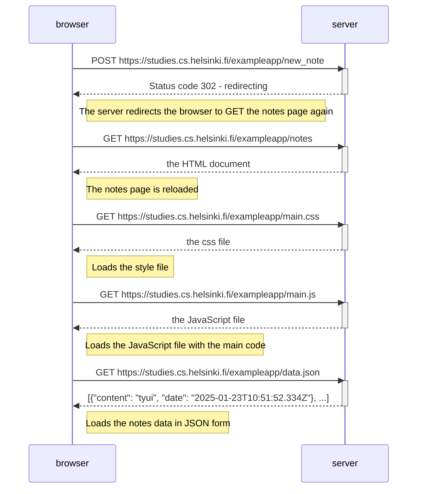

```mermaid
sequenceDiagram
    participant browser
    participant server
    
    browser->>server: POST https://studies.cs.helsinki.fi/exampleapp/new_note
    activate server
    server-->>browser: Status code 302 - redirecting
    deactivate server

    Note right of browser: The server redirects the browser to GET the notes page again
    
    browser->>server: GET https://studies.cs.helsinki.fi/exampleapp/notes
    activate server
    server-->>browser: the HTML document
    deactivate server
    
    Note right of browser: The notes page is reloaded

    browser->>server: GET https://studies.cs.helsinki.fi/exampleapp/main.css
    activate server
    server-->>browser: the css file
    deactivate server

    Note right of browser: Loads the style file
    
    browser->>server: GET https://studies.cs.helsinki.fi/exampleapp/main.js
    activate server
    server-->>browser: the JavaScript file
    deactivate server
    
    Note right of browser: Loads the JavaScript file with the main code
    
    browser->>server: GET https://studies.cs.helsinki.fi/exampleapp/data.json
    activate server
    server-->>browser: [{"content": "tyui", "date": "2025-01-23T10:51:52.334Z"}, ...]
    deactivate server    

    Note right of browser: Loads the notes data in JSON form
```