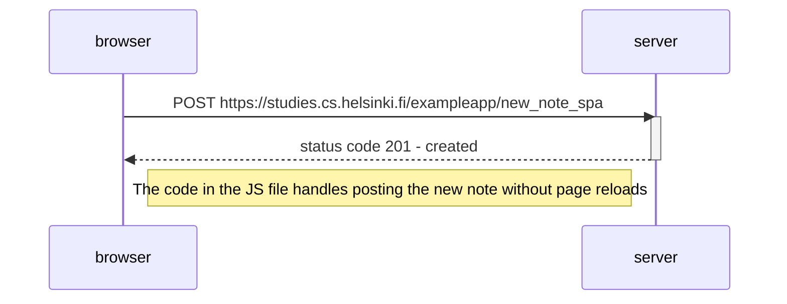

```mermaid
sequenceDiagram
    participant browser
    participant server

    browser->>server: POST https://studies.cs.helsinki.fi/exampleapp/new_note_spa
    activate server
    server-->>browser: status code 201 - created
    deactivate server

    Note right of browser: The code in the JS file handles posting the new note without page reloads
```